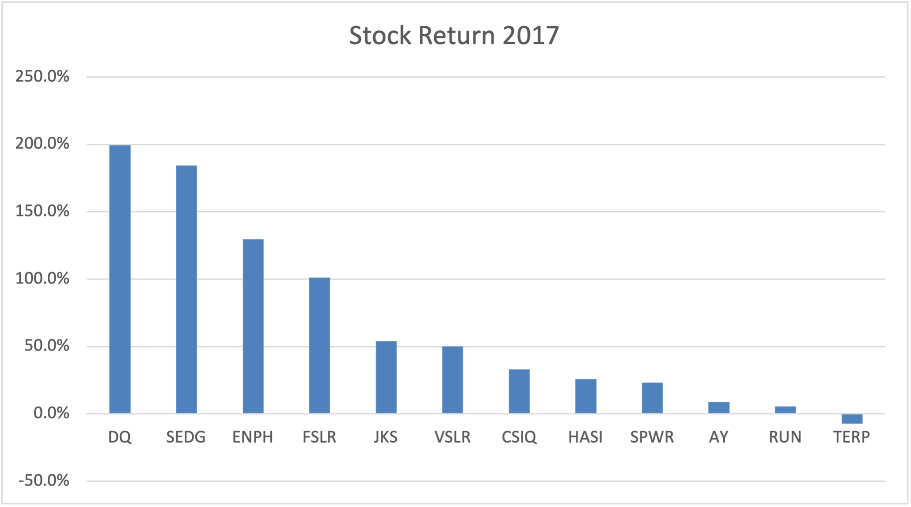
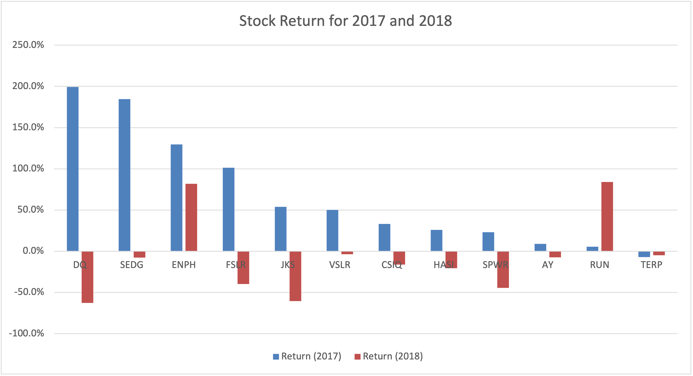

# VBA_Challenge_Week02

## **Overview:**

The goal of this project is to analyze the green stock performance for the years 2017 and 2018. The total volume of the stocks traded for each green stock and the percentage return for each stock based on the stock price at the start of the year (jan1) and end of the year (Dec31) are calculated. 

## **2017 was a boom:**
All the green stocks except TERP did very well in 2017. These stocks can be divided into high return (>100%) return, medium return (<100%-20%) and low return (<20%) 

**High return stocks:**
1.	DQ
2.	SEDG
3.	ENPH
4.	FSLR 

**Medium return stocks:**

1.	JKS
2.	VSLR
3.	SDIQ
4.	HASI
5.	SPWR

**Low return stock:**
1.	AY
2.	RUN

## **2018 was a bust:**
It is interesting how the stock returns plummeted within a year. The results look grim, like a major disaster has happened within the green energy field. Might be indication of policy shifts or a lack of progress in green energy ideas that held so much promise in 2017 but totally failed to take off in 2018.

## **Summary:**
The green stock performance for the years 2017 and 2018 were performed. Overall the stock prices saw a boom in 2017 but a major drop happened in 2018 possibly due to major policy changes or failure to meet expectations. ENPH and FSLR have stood the test of time and have emerged to be a better stock to invest when all the industry stocks failed. It is worth probing further into these two corporations as to why they performed well and that could help us guide future investments in similar green stocks.

